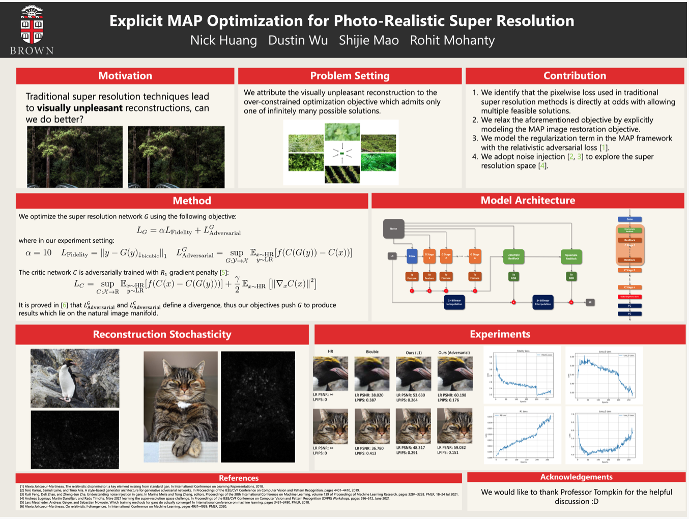

# Note

# Credit Attribution

In addition to owing inspiration to numerous papers as outlined in the Reference section of our report, We adapted the training procedure provided by the EDSR paper [1] to train our super-resolution network (cs143model.py), which was also inspired by the EDSR network.

# Contributions

In additions to making numerous modifications to the procedure defined by the EDSR paper to produce outputs for our poster/report and to save model chckpoints, our primary contributions consist of novel generator and discriminator achitectures found in src/model/NetworksV2.py, loss founctions found in src/loss/LossV2.py, and adding GAN training in the src/loss/adversarial.py and src/loss/Main.py files.

# Other Infromation

The heart of the code is located in the src directory, and was run using the commands in the demo.sh file. Given the depth of our models, training is quite time-consuming and use of a high-end GPU is almost mandatory.

Our report can be found in CS_1430_Final_Progress_Report_Final_Draft.pdf, which is in the main directory, and our poster can be found in 1430_poster_final.pdf, also in the main directory.

# Citations

[1] Bee Lim, Sanghyun Son, Heewon Kim, Seungjun Nah, and Kyoung Mu Lee, **"Enhanced Deep Residual Networks for Single Image Super-Resolution,"** <i>2nd NTIRE: New Trends in Image Restoration and Enhancement workshop and challenge on image super-resolution in conjunction with **CVPR 2017**. </i> [[PDF](http://openaccess.thecvf.com/content_cvpr_2017_workshops/w12/papers/Lim_Enhanced_Deep_Residual_CVPR_2017_paper.pdf)] [[arXiv](https://arxiv.org/abs/1707.02921)] [[Slide](https://cv.snu.ac.kr/research/EDSR/Presentation_v3(release).pptx)]
